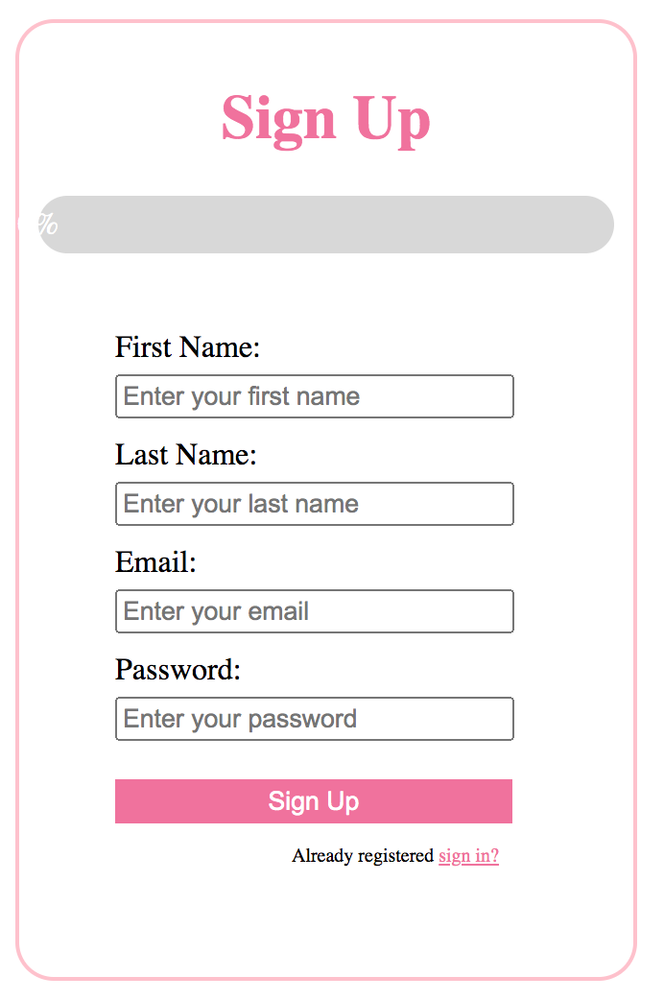
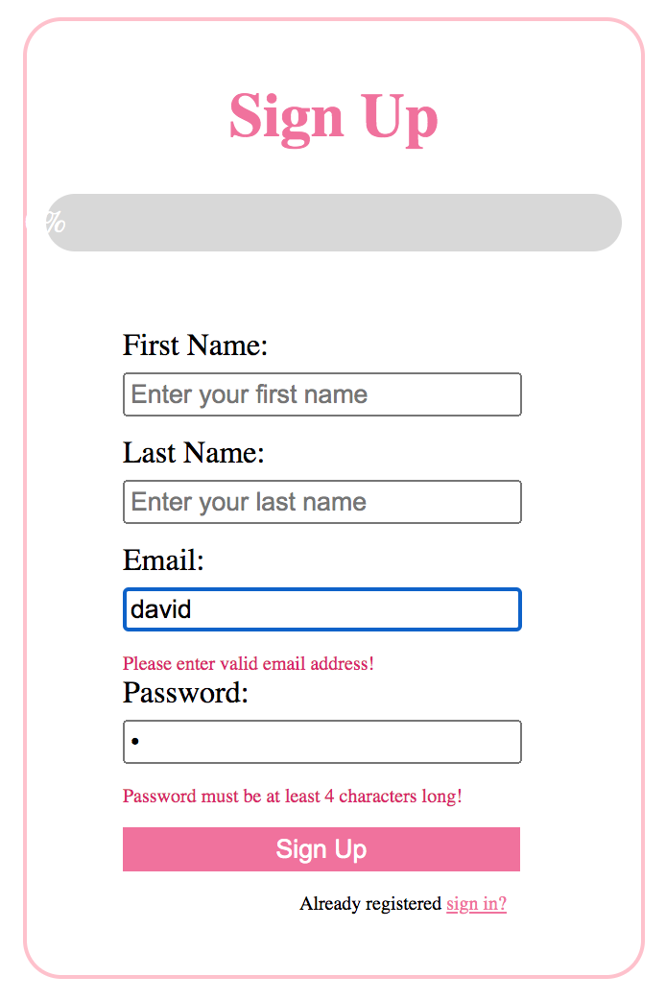
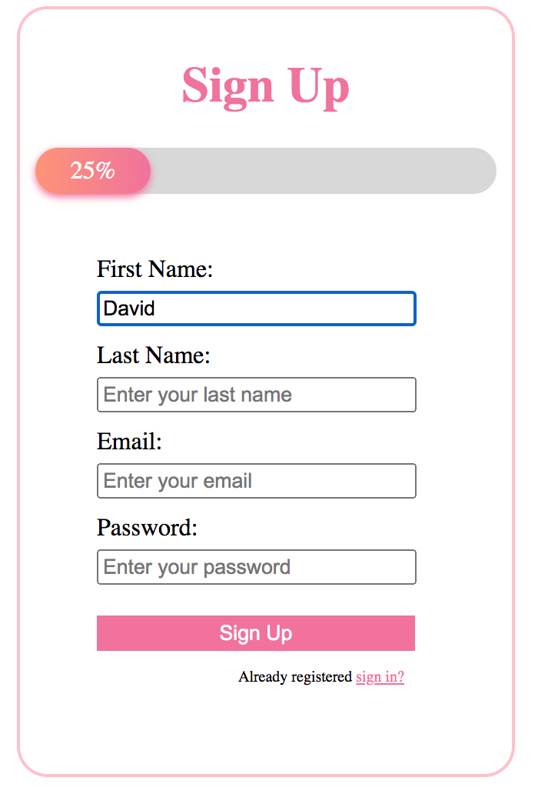
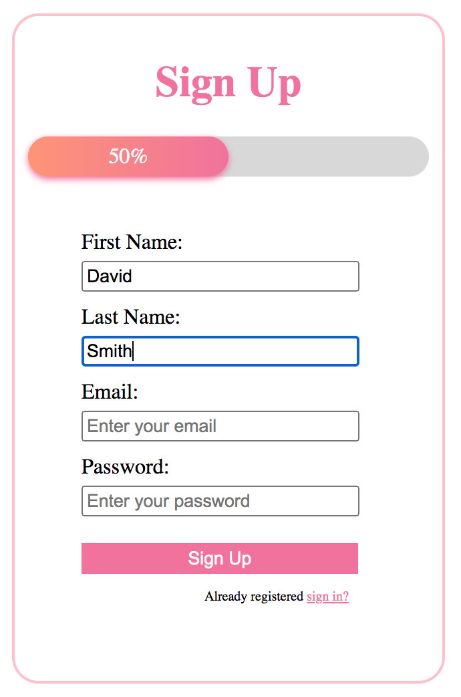
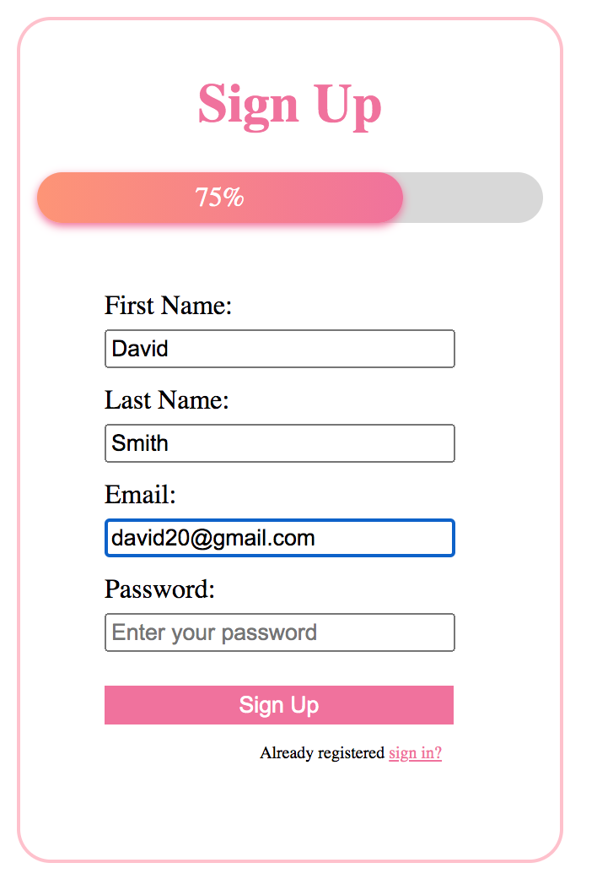
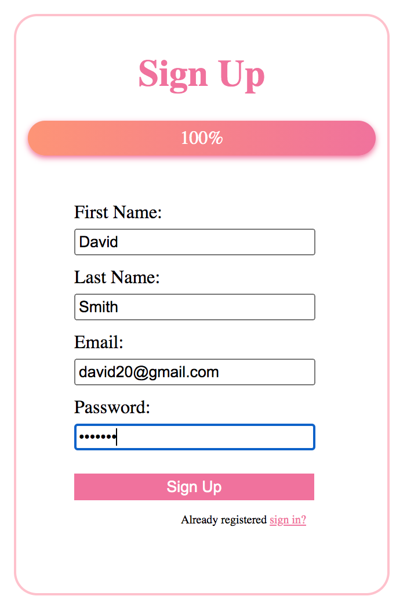

# Login_with_Progress_Bar
Build a login page with progress bar in React.

This project was bootstrapped with [Create React App](https://github.com/facebook/create-react-app).

## Run the app

- Execute `config.sh` to create a React App
- Download the file **index.css** into the **src/** folder
- Download the file **index.js** into the **src/** folder
- Run `npm start` in the **my-app/** folder 
- Open [http://localhost:3000](http://localhost:3000) to view it in the browser.

## Example
- The login page looks like:  
  

- Validating a login form:  
  

- The state of the progress bar:  

1. The progress bar is at 25% if one field has a valid value:  
  

2. The progress bar is at 25% if two fields have valid values: 
  
  
3. The progress bar is at 25% if three fields have valid values: 
  

4. The progress bar is at 100% if all fields have valid values: 
  
